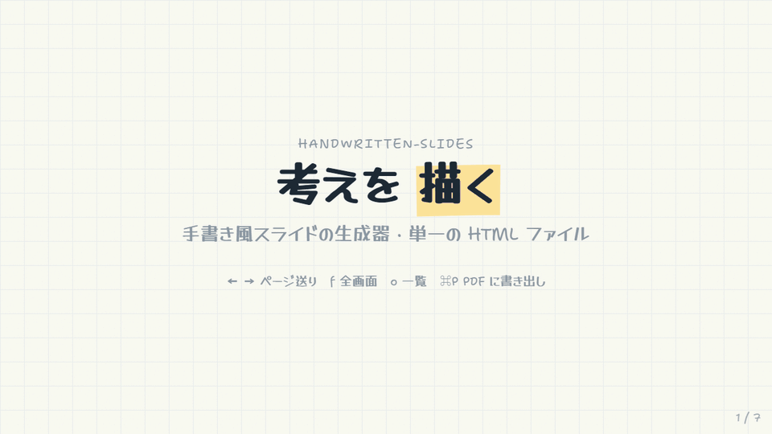
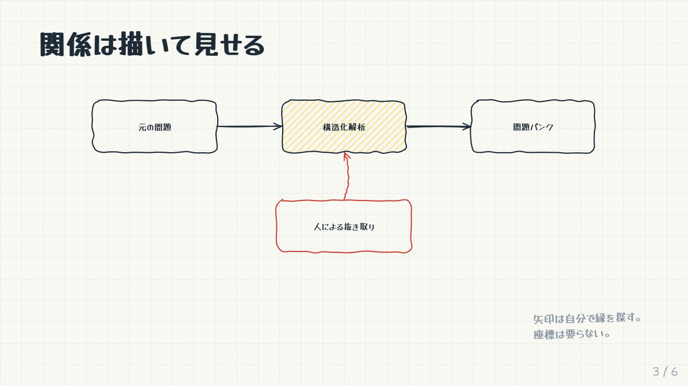
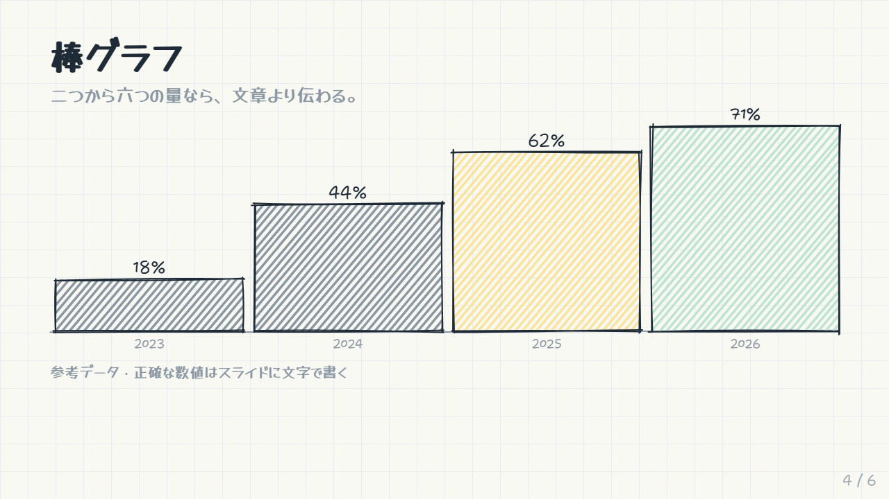
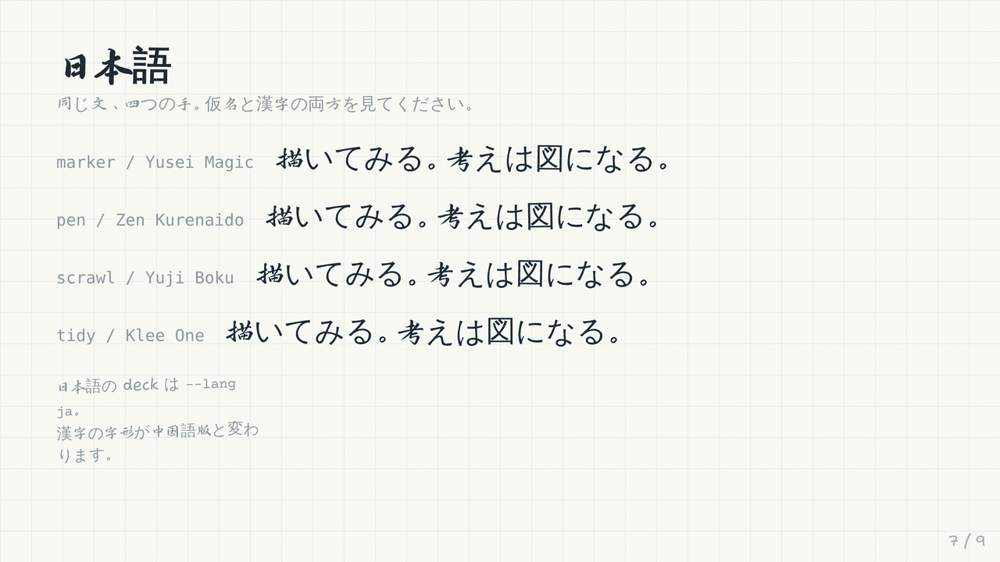
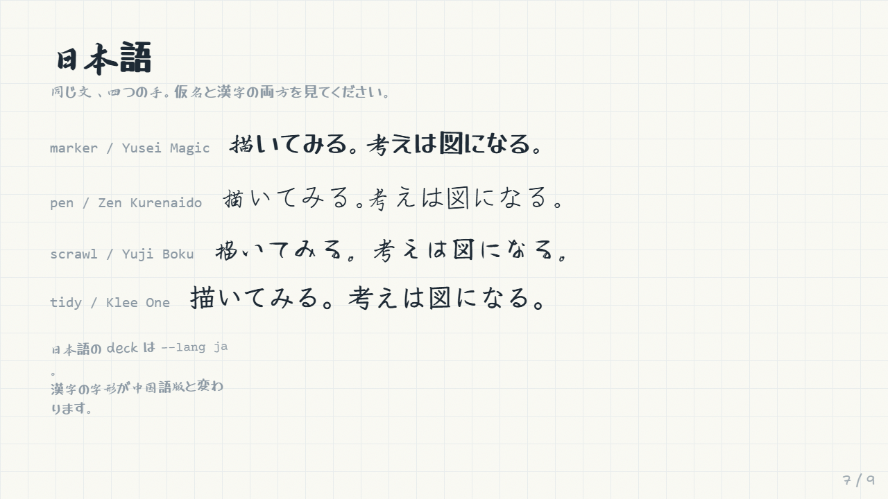
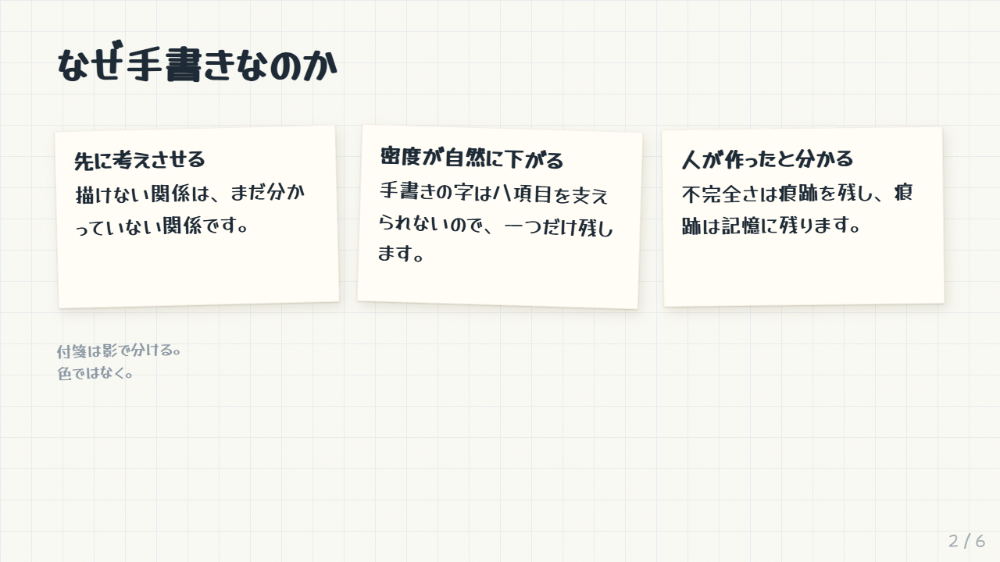
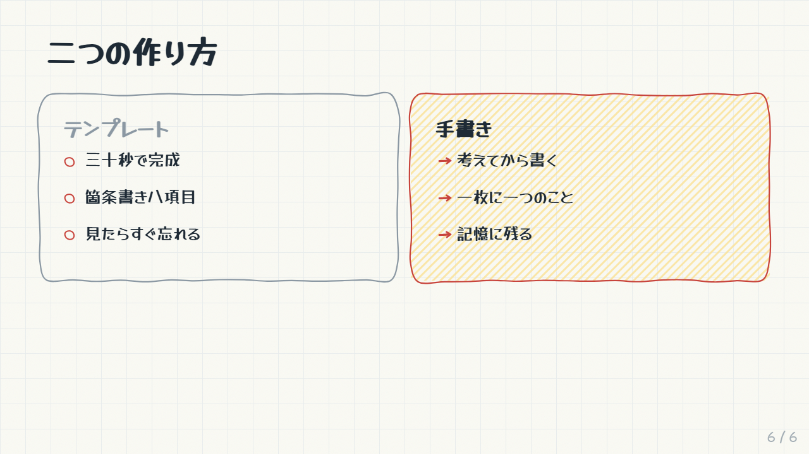

# handwritten-slides

[English](README.md) · [简体中文](README.zh-CN.md) · **日本語**

紙に描いたように見えるプレゼン資料。揺れるインクの輪郭、マーカーのハイライト、付箋、手描きのグラフ。デッキ全体が自己完結した 1 つの HTML ファイルなので、ブラウザで発表しても、PDF に印刷しても、そのまま誰かに送ってもかまいません。

CJK を最優先に設計しています。このスタイルで難しいのはラテン文字ではありません。中国語と日本語を英語と同じ筆致にそろえ、こっそりシステムのゴシック体に逃げさせないことです。



ビルドシステムもフレームワークもありません。すべての線はバニラ JS が描き、標準ライブラリだけの Python スクリプトがそれを 1 つのファイルにインライン化します。

---

## クイックスタート

```bash
git clone https://github.com/BayarBH/handwritten-slides
cd handwritten-slides

python3 scripts/build.py demo/ja-slides.html -o deck.html \
    --title "私のデッキ" --lang ja --all-fonts
```

`--all-fonts` は、このデモが 1 枚で手書きセットを比較しているためだけに付けています。

自分のデッキは `<section class="slide">` の断片だけで書けます。`<html>` もスタイルも要りません：

```html
<section class="slide">
  <div class="stage">
    <h2>一枚に一つの主張</h2>
    <p>強調は <span data-sketch="highlight">一箇所だけ</span>。</p>
  </div>
</section>
```

フォントは Google Fonts と jsDelivr から読み込むので、開くときはネット接続が必要です。完全にオフラインのファイルにするなら `--embed-cjk` を付けます。`pip install fonttools` と Node の `npm` が必要で、成果物を共有する前に [FONTS.md](FONTS.md) を読んでください。

`deck.html` を開きます。`←` `→` でページ送り、`f` で全画面、`o` で一覧グリッド、`⌘P` で PDF 書き出し（スライド 1 枚につき横向き 1 ページ）。

| フラグ | 選択肢 | |
|---|---|---|
| `--hand` | `marker` `pen` `scrawl` `tidy` | 使う手書きセット |
| `--lang` | `zh` `ja` `en` | 中日共通の字形をどのフォントで表示するか |
| `--theme` | `paper` `cream` `board` | 寒色の白 / 暖かいオフホワイト / 黒板 |
| `--paper` | `grid` `dot` `plain` | 罫線の種類 |
| `--rough` | `1`–`3` | 揺れの強さ（整然〜ラフ） |
| `--jitter` | `0`–`2` | CJK 文字ごとの揺らぎ |
| `--embed-cjk` | | CJK フォントのサブセットを埋め込む（先に [FONTS.md](FONTS.md) を読んでください） |

---

## 描画

任意の要素に `data-sketch` を付けると、フォントの読み込み後にその要素に合わせた手描きの図形が描かれます。揺れは要素をシードに生成されるため、リサイズ、段階表示、印刷のあいだも位置が変わらず、ちらつきません。

```html
<div id="a" class="card" data-sketch="box" data-sketch-fill="yellow">结构化解析</div>
<div id="b" class="card" data-sketch="box">题库</div>
<div data-sketch="arrow" data-from="#a" data-to="#b" data-bend="0.2"></div>
```

矢印は自分で要素の端を見つけるので、座標を書く必要はありません。



`box` `circle` `underline` `strike` `highlight` `cloud` `bracket` `check` `cross` `arrow` `bars` `plot`：全カタログとコピペ用のマークアップは [references/components.md](references/components.md) にあります。

グラフはあえて大まかにしています。示すのは形であって読み取り値ではありません。正確な数値はテキストとしてスライドに書いてください。



---

## 4 種類の手書き



| `--hand` | ラテン文字 | 中国語 | 日本語 | 用途 |
|---|---|---|---|---|
| `marker` | Shantell Sans, INFM 100 | 鸿雷行书简体 | Yusei Magic | ライブ発表、要素の少ないスライド |
| `pen` | Shantell Sans, INFM 45 | 瑞美加张清平硬笔行书 | Zen Kurenaido | 文字の多いデッキ |
| `scrawl` | Shantell Sans, BNCE 45 | 千图笔锋手写体 | Yuji Boku | 表紙、短いデッキ |
| `tidy` | Caveat + Kalam | 霞鹜文楷 | Klee One | 暗いプロジェクター、遠い聴衆 |

### なぜここがいちばん面白いところになったのか

問題は 3 つあり、どれも「もっときれいなフォントを選ぶ」では解決しません。

**字形の繰り返し。** ほとんどの手書きフォントは 1 文字につき 1 つの字形しか持たないため、スライド上の `a` はすべてピクセル単位で同じになります。これは「書いた」のではなく「組んだ」ことがいちばんばれる点です。Shantell Sans はラテン文字でこれを解決しています。`rlig` 機能が異体字を順に切り替えるので、同じ文字が繰り返されても形が変わります。中国語や日本語のフォントでこれができるものはなく、今後も出てこないでしょう。6,763 字それぞれに 3 種類描けば 2 万字を超えます。そこで揺らぎはレンダリング時に加えます。CJK の各文字を inline-block で包み、シード付きの回転、オフセット、拡大縮小を与えます。シードは文字*と*その位置の両方から決まるので、同じ文字でも本当に違って見えます。transform はレイアウトボックスを動かさないため、図形の計測は正確なままで、テキストもそのままコピーできます。

**スタイルではなく線の太さ。** いちばんよくある失敗は、CJK フォントの手書き感が足りないことではありません。隣のラテン文字より*細い*ことです。演示悠然小楷をマーカーの太さの Shantell Sans の隣に置くと、どちらも手書き体なのに、目は「英語は描かれ、中国語は組まれている」と判断します。そこで各手書きセットは `--hand-body-weight` と `--hand-display-weight` を CJK フォントに合わせて設定しています。`pen` はラテン文字を 300 まで下げ、`scrawl` は 500 まで上げます。日本語にも同じ罠があり、真っ先に思いつく Yomogi と Klee One はどちらも細めです。本当にマーカーの太さがある無料の日本語手書きフォントは Yusei Magic だけです。

**名前は当てにならない。** 「手写体」として配布されているフォントのいくつかは、レンダリングするとただの印刷用楷書体です。江西拙楷がその一例で、画像にして実際に見るまでは、このリポジトリの `scrawl` 用フォントでした。ここに載せたフォントはすべて、画像にレンダリングして評価してから採用しています。



日本語のデッキには `--lang ja` が必要です。Klee One と中国語フォントは共通のコードポイントで字形が食い違います（直、骨、毎は字形の規範が異なります）。フォントスタックで先に来たほうが、両方がカバーする文字をすべて引き受けてしまいます。

---

## テーマと紙



付箋は黄色、`.cream`、`.mint`、`.blue`、`.pink` があります。アイボリーは控えめな選択肢です。デフォルトの紙の上では地色とのコントラストが 1.02 しかなく、色では区別できません。そのため 2 層の影、つまりぴったり接した影と柔らかい環境光の影だけで見分けられるようにしています。白い紙の上に置いた白いメモ用紙と同じです。

各テーマは背景の差し替えではなく、配色一式です。暖色の地は寒色のインクを沈ませるので、`cream` ではペンの色を暖色寄りに混ぜ直し、塗りの彩度も上げています。前景色はすべて、実際に置かれる面に対してチェックしました。蛍光ペンの上に重なるインクも含みます。（`cream` でいちばん自然な明るい鉛筆グレーはコントラスト 4.07 で、下限の 4.5 に届かないため `#736A56` にしています。）

---

## フォントとライセンス

**コードは MIT ですが、フォントは違います。** `--embed-cjk` は出力ファイルの*中に*フォントのサブセットを入れます。フォントファイルの再配布は、フォントを使う権利とは別の権利です。

`@chinese-fonts/*` パッケージはどれも `"license": "MIT"` と宣言していますが、この MIT はパッケージングプロジェクトのもので、フォント自体のものではありません。フォントには独自の *all rights reserved* の表記があります。フォントごとの表と、公開してよいものについては [FONTS.md](FONTS.md) を見てください。要するに、発表と印刷は自由です。ビルド済みのデッキをコミットしたり、製品に組み込んだりする前には、よく考えてください。日本語とラテン文字のフォントはすべて SIL OFL なので、この問題はありません。

そのため、このリポジトリにはビルド済みのデッキを一切コミットしていません。

---

## 内容の原則

このスタイルは情報を詰め込むと崩れます。手書き体の文章の壁は、同じ壁を Helvetica で書いたものより読みにくくなります。制約こそが要点です。

- 1 枚のスライドに主張は 1 つ。「と」でつなぐ必要があるなら、それは 2 枚です。
- 本文は約 30 語以内。
- 飾りではなく関係を描く。矢印は*原因になる*、*変わる*、*入力になる*を意味するべきです。
- ハイライトは 1 枚につき 1 回だけ。
- 続くスライドの形に変化をつける：タイトル → 付箋 3 枚 → 図 1 つ → 大きな数字 1 つ → 比較。



---

## ディレクトリ構成

```
assets/sketch.js      the drawing engine — one function per data-sketch shape
assets/sketch.css     palette, hands, themes, slide layout, print rules
assets/shell.html     the template build.py fills
scripts/build.py      fragment -> one self-contained HTML file
scripts/embed_font.py subset a CJK face to a deck's characters and inline it
references/           component catalogue and font notes, written for an LLM to read
demo/                 slide fragments; build them yourself
```

図形を追加するには、`sketch.js` の `draw` オブジェクトに関数を 1 つ追加します。手書きセットを追加するには、`sketch.css` にブロックを 1 つ、`build.py` の `HANDS` にエントリを 1 つ追加します。

[Claude Skill](https://docs.claude.com/en/docs/agents-and-tools/agent-skills/overview) としても使えます。`SKILL.md` と `references/` はそのために書かれています。ディレクトリを zip にして読み込むか、ファイルを自分で読んでください。

## ライセンス

コードは MIT です。フォントについては [FONTS.md](FONTS.md) を見てください。
