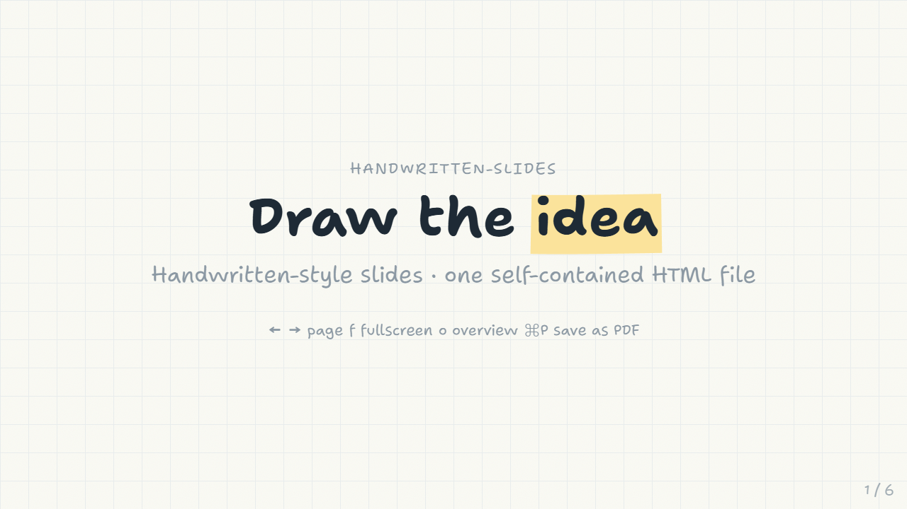
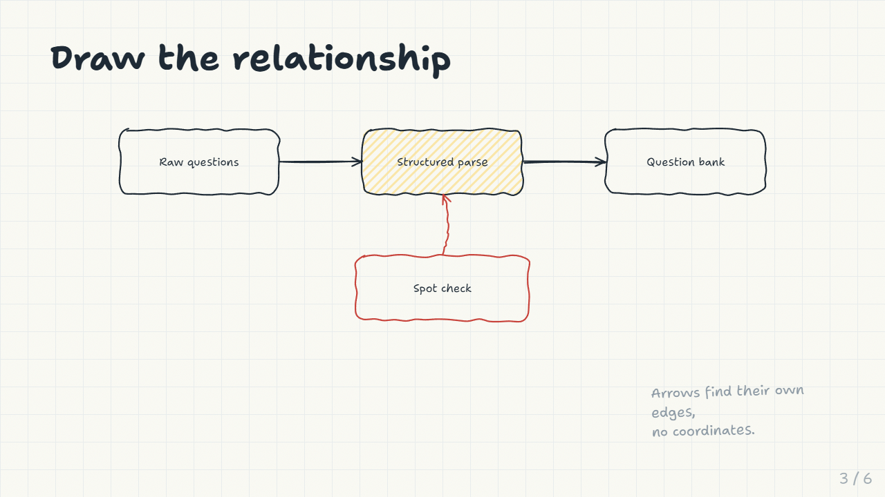
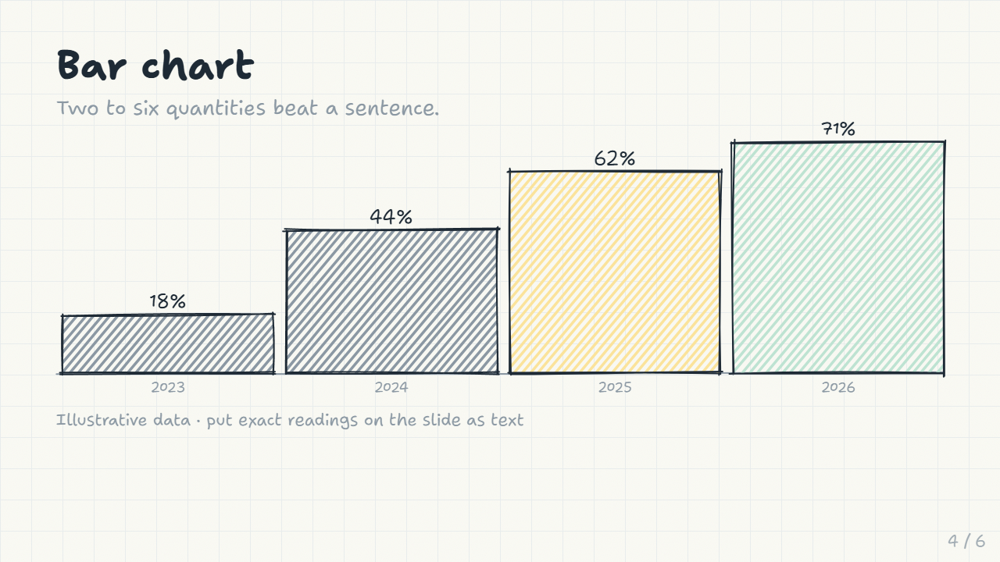
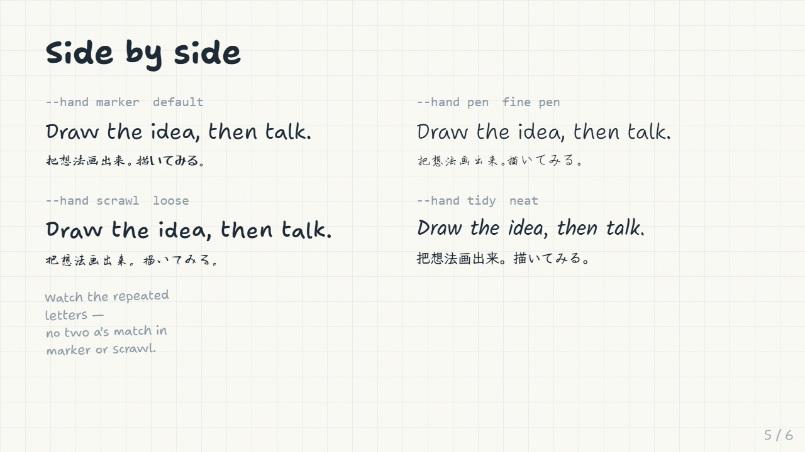
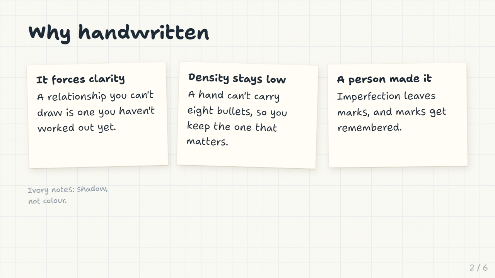
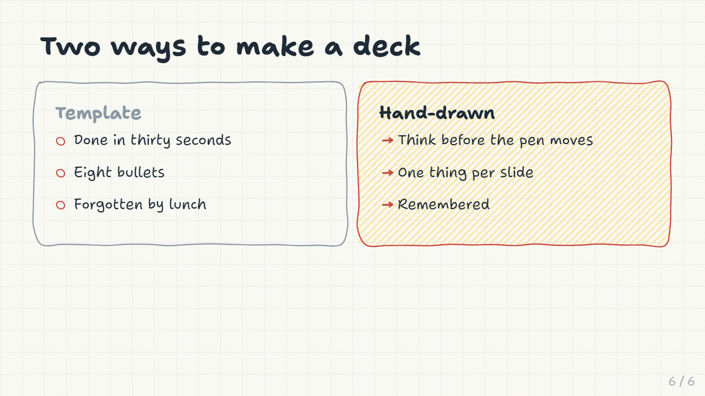

# handwritten-slides

**English** · [简体中文](README.zh-CN.md) · [日本語](README.ja.md)

Presentation decks that look drawn on paper — wobbly ink outlines, marker highlights, sticky notes, sketched charts. One self-contained HTML file: present in the browser, print to PDF, mail it to someone.

Built for CJK first. The hard part of this style isn't the Latin; it's keeping Chinese and Japanese in the same voice as the English instead of quietly falling back to a system sans.



No build system, no framework. Vanilla JS draws every stroke; one stdlib-only Python script inlines it into one file.

---

## Quick start

```bash
git clone https://github.com/BayarBH/handwritten-slides
cd handwritten-slides

python3 scripts/build.py demo/en-slides.html -o deck.html \
    --title "My deck" --lang en --all-fonts
```

`--all-fonts` is only there because this demo compares hands on one slide.

Your own deck is just a fragment of `<section class="slide">` blocks — no `<html>`, no styles:

```html
<section class="slide">
  <div class="stage">
    <h2>One claim per slide</h2>
    <p>Spend the <span data-sketch="highlight">highlight</span> once.</p>
  </div>
</section>
```

Fonts load from Google Fonts and jsDelivr, so the deck wants a network connection. For a fully offline file add `--embed-cjk` — it needs `pip install fonttools` and Node's `npm`, and read [FONTS.md](FONTS.md) before sharing the result.

Open `deck.html`. `←` `→` to move, `f` fullscreen, `o` overview grid, `⌘P` to export PDF (one slide per landscape page).

| Flag | Options | |
|---|---|---|
| `--hand` | `marker` `pen` `scrawl` `tidy` | which handwriting set |
| `--lang` | `zh` `ja` `en` | decides which face wins shared CJK glyphs |
| `--theme` | `paper` `cream` `board` | cool white / warm off-white / chalkboard |
| `--paper` | `grid` `dot` `plain` | the ruling |
| `--rough` | `1`–`3` | wobble, tidy to loose |
| `--jitter` | `0`–`2` | per-character CJK variation |
| `--embed-cjk` | | inline the CJK font subset (read [FONTS.md](FONTS.md) first) |

---

## Drawing

Add `data-sketch` to any element and a hand-drawn shape is fitted to it after the fonts land. The wobble is seeded from the element, so it stays put across resize, reveal and print rather than shimmering.

```html
<div id="a" class="card" data-sketch="box" data-sketch-fill="yellow">结构化解析</div>
<div id="b" class="card" data-sketch="box">题库</div>
<div data-sketch="arrow" data-from="#a" data-to="#b" data-bend="0.2"></div>
```

Arrows find their own edges, so nothing needs coordinates.



`box` `circle` `underline` `strike` `highlight` `cloud` `bracket` `check` `cross` `arrow` `bars` `plot` — the full catalogue with copy-paste markup is in [references/components.md](references/components.md).

Charts are deliberately approximate. They show shape, not readings; put exact numbers on the slide as text.



---

## The four hands



| `--hand` | Latin | Chinese | Japanese | For |
|---|---|---|---|---|
| `marker` | Shantell Sans, INFM 100 | 鸿雷行书简体 | Yusei Magic | Presenting live, sparse slides |
| `pen` | Shantell Sans, INFM 45 | 瑞美加张清平硬笔行书 | Zen Kurenaido | Text-dense decks |
| `scrawl` | Shantell Sans, BNCE 45 | 千图笔锋手写体 | Yuji Boku | Covers, short decks |
| `tidy` | Caveat + Kalam | 霞鹜文楷 | Klee One | Weak projector, distant audience |

### Why this ended up being the interesting part

Three problems, none of which is "pick a nicer font":

**Glyph repetition.** Most handwriting fonts store one shape per character, so every `a` on a slide is pixel-identical — the loudest tell that the type is set rather than written. Shantell Sans fixes it for Latin: an `rlig` feature cycles through alternates, so repeated letters differ. No Chinese or Japanese font can do this and none likely will — three variants of 6,763 glyphs is twenty thousand drawings. So the variation is added at render time instead: each CJK character is wrapped in an inline-block and given a seeded rotation, offset and scale, keyed on the character *and* its position so repeats genuinely differ. Transforms don't move the layout box, so the sketch measurements stay correct, and the text stays exactly copyable.

**Stroke weight, not style.** The commonest failure isn't that a CJK face looks insufficiently handwritten — it's that it's *lighter* than the Latin beside it. Set 演示悠然小楷 next to marker-weight Shantell Sans and the eye reports "the English is drawn, the Chinese is typeset," even though both are handwriting. Each hand therefore sets `--hand-body-weight` and `--hand-display-weight` to match its CJK faces: `pen` pulls the Latin down to 300, `scrawl` pushes it to 500. The same trap catches Japanese, and the two obvious picks — Yomogi and Klee One — are both light. Yusei Magic is the only free Japanese handwriting face at genuine marker weight.

**Names lie.** Several fonts sold as 手写体 render as ordinary printed kai. 江西拙楷 is one, and it was in this repo as the `scrawl` face until it got rasterised and looked at. Every face here was rendered and judged as an image before being listed.


Japanese decks need `--lang ja`: Klee One and the Chinese faces disagree on shared codepoints — 直, 骨, 每 follow different drawing conventions — and whichever sits first in the stack takes every character both cover.

---

## Themes and paper



Sticky notes come in yellow, `.cream`, `.mint`, `.blue`, `.pink`. The ivory one is the quiet option: on the default paper it sits at 1.02 contrast from the ground, so no colour separation is possible and it's read entirely through a two-layer shadow — a tight contact shadow plus a soft ambient one — the way a white memo sheet on white paper is.

Each theme is a whole palette, not a background swap: a warm ground swallows cool inks, so `cream` re-mixes the pens warm and re-saturates the washes. Every foreground was checked against the surface it actually sits on, including ink over a highlighter swipe. (The obvious lighter pencil grey for `cream` lands at 4.07 contrast, under the 4.5 floor — it's `#736A56` instead.)

---

## Fonts and licensing

**The code is MIT. The fonts are not.** `--embed-cjk` puts a font subset *inside* your output file, and redistributing a font binary is a different right from using the font.

The `@chinese-fonts/*` packages all declare `"license": "MIT"` — that MIT belongs to the packaging project, not to the fonts, which carry their own *all rights reserved* notices. [FONTS.md](FONTS.md) has the per-font table and what's safe to publish. Short version: present and print freely; think before committing a built deck or shipping one inside a product. The Japanese and Latin faces are all SIL OFL and carry no such problem.

This repo commits no built decks for that reason.

---

## Content discipline

The style collapses under density — a wall of text in a handwriting face is harder to read than the same wall in Helvetica, not easier. The constraint is the point:

- One claim per slide. If it needs "and", it's two slides.
- Under ~30 words of body text.
- Draw the relationship, not the decoration. An arrow should mean *causes*, *becomes*, *feeds*.
- Spend the highlight once per slide.
- Vary the shape of consecutive slides: title → three stickies → one diagram → one big number → a comparison.



---

## Layout

```
assets/sketch.js      the drawing engine — one function per data-sketch shape
assets/sketch.css     palette, hands, themes, slide layout, print rules
assets/shell.html     the template build.py fills
scripts/build.py      fragment -> one self-contained HTML file
scripts/embed_font.py subset a CJK face to a deck's characters and inline it
references/           component catalogue and font notes, written for an LLM to read
demo/                 slide fragments; build them yourself
```

To add a shape, add a function to the `draw` object in `sketch.js`. To add a hand, add a block to `sketch.css` and an entry to `HANDS` in `build.py`.

It also works as a [Claude Skill](https://docs.claude.com/en/docs/agents-and-tools/agent-skills/overview) — `SKILL.md` and `references/` are written for that. Zip the directory and load it, or just read the files yourself.

## License

MIT for the code. See [FONTS.md](FONTS.md) for the fonts.
