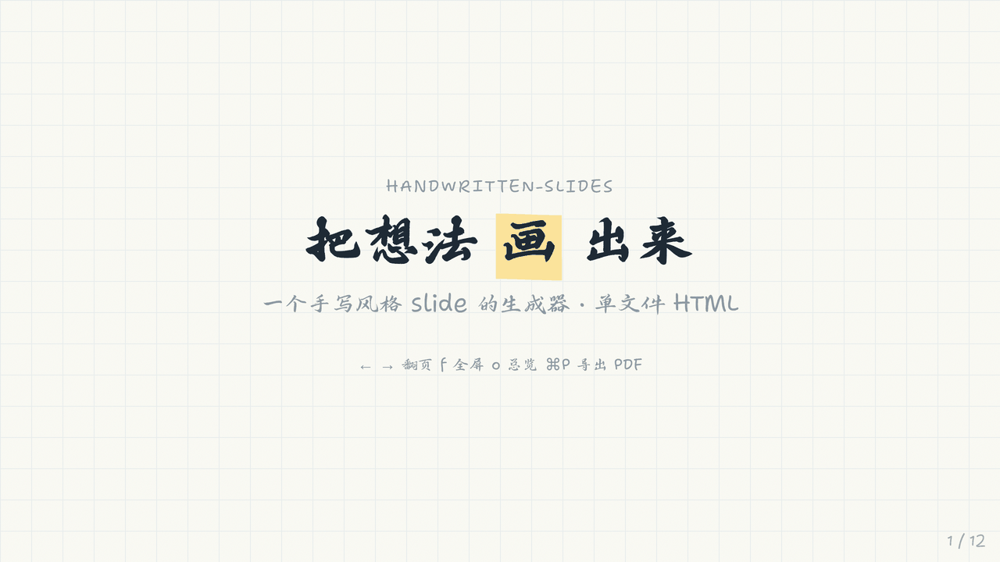
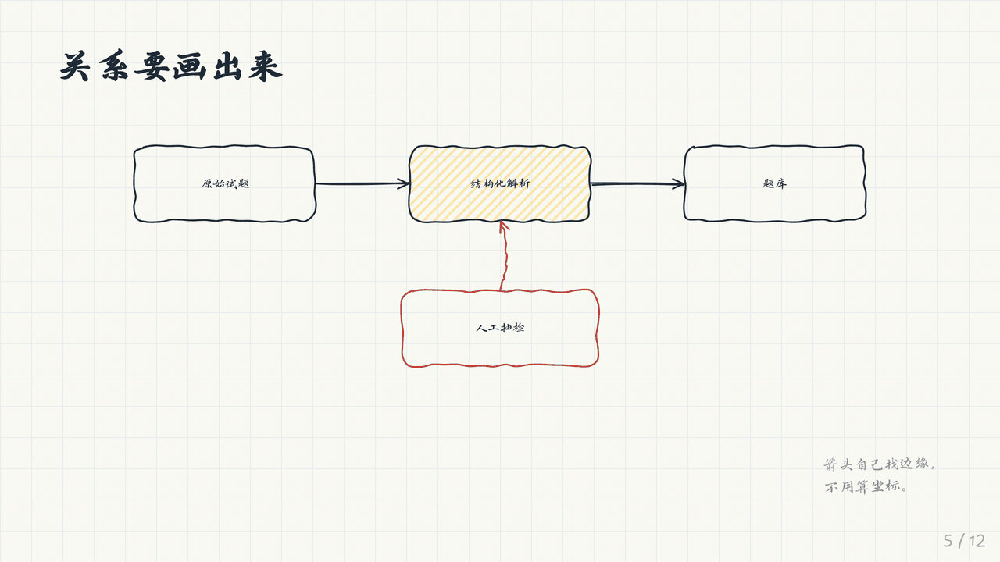
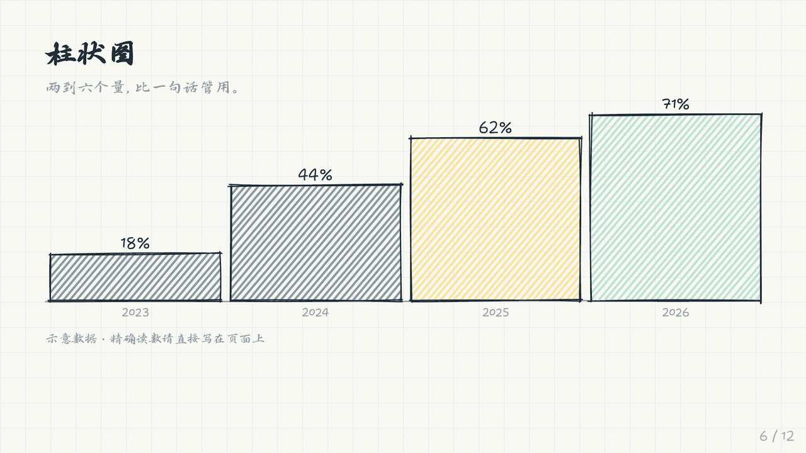
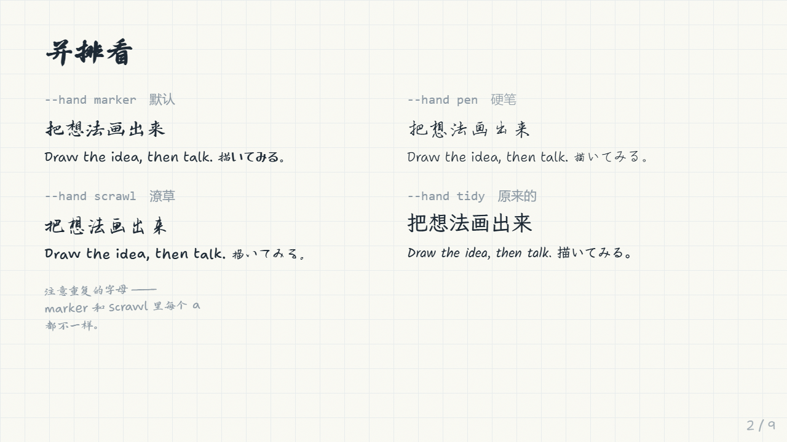
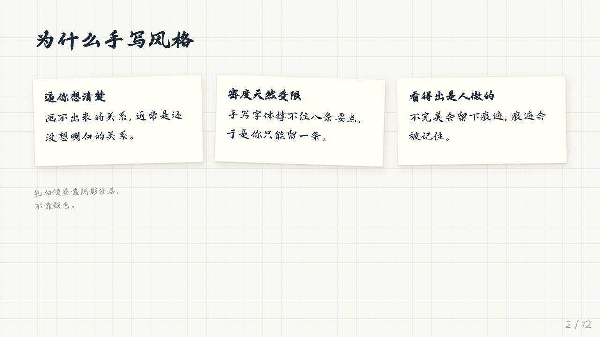
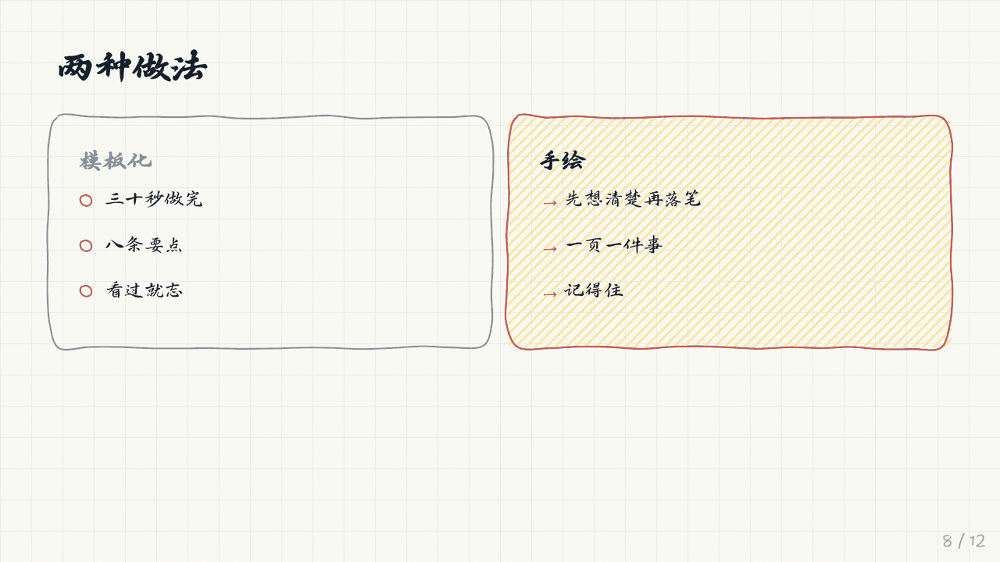

# handwritten-slides

[English](README.md) · **简体中文** · [日本語](README.ja.md)

看起来像画在纸上的演示文稿：抖动的墨线轮廓、马克笔高亮、便利贴、手绘图表。整个 deck 是一个自包含的 HTML 文件，可以在浏览器里演示、打印成 PDF，或者直接发给别人。

为中日文优先设计。这种风格难的不是拉丁字母，而是让中文、日文和英文保持同一种笔调，而不是悄悄退回系统无衬线字体。



没有构建系统，没有框架。每一笔都由原生 JS 绘制；一个只用标准库的 Python 脚本把它们内联成单个文件。

---

## 快速开始

```bash
git clone https://github.com/BayarBH/handwritten-slides
cd handwritten-slides

python3 scripts/build.py demo/slides.html -o deck.html \
    --title "我的 deck" --lang zh
```

你自己的 deck 只需要一段 `<section class="slide">` 片段，不用写 `<html>`，也不用写样式：

```html
<section class="slide">
  <div class="stage">
    <h2>一页只讲一件事</h2>
    <p>荧光笔 <span data-sketch="highlight">一页只用一次</span>。</p>
  </div>
</section>
```

字体从 Google Fonts 和 jsDelivr 加载，打开 deck 时需要联网。要完全离线的文件就加 `--embed-cjk`，它需要 `pip install fonttools` 和 Node 的 `npm`；分享成品之前请先读 [FONTS.md](FONTS.md)。

打开 `deck.html`。`←` `→` 翻页，`f` 全屏，`o` 总览网格，`⌘P` 导出 PDF（每张 slide 一页横向）。

| 参数 | 选项 | |
|---|---|---|
| `--hand` | `marker` `pen` `scrawl` `tidy` | 使用哪套笔迹 |
| `--lang` | `zh` `ja` `en` | 决定中日共用字形由哪款字体显示 |
| `--theme` | `paper` `cream` `board` | 冷白 / 暖米白 / 黑板 |
| `--paper` | `grid` `dot` `plain` | 纸面格线 |
| `--rough` | `1`–`3` | 抖动程度，从工整到潦草 |
| `--jitter` | `0`–`2` | 中日文逐字变化 |
| `--embed-cjk` | | 内嵌中日文字体子集（请先读 [FONTS.md](FONTS.md)） |

---

## 绘图

给任意元素加上 `data-sketch`，字体加载完成后就会贴合它画出一个手绘形状。抖动以元素为种子生成，所以在缩放、逐步显示和打印时都保持不变，不会闪动。

```html
<div id="a" class="card" data-sketch="box" data-sketch-fill="yellow">结构化解析</div>
<div id="b" class="card" data-sketch="box">题库</div>
<div data-sketch="arrow" data-from="#a" data-to="#b" data-bend="0.2"></div>
```

箭头会自己找到元素的边缘，不需要写任何坐标。



`box` `circle` `underline` `strike` `highlight` `cloud` `bracket` `check` `cross` `arrow` `bars` `plot`：完整目录和可直接复制的标记见 [references/components.md](references/components.md)。

图表是刻意做成近似的。它们表现的是形状，不是读数；确切的数字请作为文字写在 slide 上。



---

## 四种笔迹



| `--hand` | 拉丁字母 | 中文 | 日文 | 适用场景 |
|---|---|---|---|---|
| `marker` | Shantell Sans, INFM 100 | 鸿雷行书简体 | Yusei Magic | 现场演讲、内容稀疏的 slide |
| `pen` | Shantell Sans, INFM 45 | 瑞美加张清平硬笔行书 | Zen Kurenaido | 文字较多的 deck |
| `scrawl` | Shantell Sans, BNCE 45 | 千图笔锋手写体 | Yuji Boku | 封面、短 deck |
| `tidy` | Caveat + Kalam | 霞鹜文楷 | Klee One | 投影仪较暗、观众离得远 |

### 为什么这反而成了最有意思的部分

三个问题，没有一个是"挑一款更好看的字体"能解决的：

**字形重复。** 大多数手写字体每个字符只存一种字形，所以 slide 上每个 `a` 都一模一样，这是"排出来的"而非"写出来的"最明显的破绽。Shantell Sans 在拉丁字母上解决了这个问题：`rlig` 特性会在多个替代字形之间轮换，所以重复的字母各不相同。没有任何中文或日文字体能做到这一点，以后大概也不会有：6,763 个字各画三个变体就是两万多个字形。所以变化改在渲染时添加：每个中日文字符被包进一个 inline-block，再给它一个带种子的旋转、偏移和缩放，种子同时取决于字符*和*它的位置，所以重复的字真的会不一样。transform 不会移动布局盒，所以手绘形状的测量仍然准确，文字也能原样复制。

**笔画粗细，而不是风格。** 最常见的失败不是中日文字体看起来"不够手写"，而是它比旁边的拉丁字母*更细*。把演示悠然小楷和马克笔粗细的 Shantell Sans 放在一起，眼睛会告诉你"英文是画的，中文是排的"，尽管两者都是手写体。所以每种笔迹都设置了 `--hand-body-weight` 和 `--hand-display-weight` 来匹配它的中日文字体：`pen` 把拉丁字母降到 300，`scrawl` 提到 500。日文也有同样的陷阱，两个最顺手的选择 Yomogi 和 Klee One 都偏细。Yusei Magic 是唯一一款真正达到马克笔粗细的免费日文手写体。

**名字会骗人。** 好几款以"手写体"为名的字体，渲染出来就是普通的印刷楷体。江西拙楷就是一例，它曾经是本仓库 `scrawl` 的字体，直到被渲染成图片看了一眼。这里列出的每款字体，都先渲染成图片评估过才收录。


日文 deck 需要 `--lang ja`：Klee One 和中文字体在共用码位上意见不一（直、骨、每的写法规范不同），字体栈里排在前面的那一款会接管两者都覆盖的所有字符。

---

## 主题与纸面



便利贴有黄色、`.cream`、`.mint`、`.blue`、`.pink` 几种。象牙色那款是低调的选择：在默认纸面上它和底色的对比度只有 1.02，无法靠颜色区分，完全靠两层阴影来辨认：一层贴得很紧的接触阴影，加一层柔和的环境阴影，就像白纸上放着一张白色便签。

每个主题都是一整套配色，而不只是换个背景：暖色底会吞掉冷色墨水，所以 `cream` 把笔的颜色重新调暖，并重新提高了涂色的饱和度。每种前景色都针对它实际所在的表面检查过，包括压在荧光笔划痕上的墨迹。（`cream` 上最直观的浅铅笔灰对比度只有 4.07，低于 4.5 的下限，所以用的是 `#736A56`。）

---

## 字体与许可

**代码是 MIT，字体不是。** `--embed-cjk` 会把字体子集放*进*输出文件里，而再分发字体文件和使用字体是两项不同的权利。

`@chinese-fonts/*` 包都声明了 `"license": "MIT"`，但这个 MIT 属于打包项目，不属于字体本身；字体自带的声明是 *all rights reserved*。逐款字体的表格以及哪些可以公开发布，见 [FONTS.md](FONTS.md)。简单说：演示和打印随意；提交构建好的 deck，或者把它放进产品里之前，先想清楚。日文和拉丁字体都是 SIL OFL，没有这个问题。

出于这个原因，本仓库不提交任何构建好的 deck。

---

## 内容原则

这种风格一旦内容密集就会垮掉：一大段手写体文字比同样一段 Helvetica 更难读，而不是更好读。限制本身就是重点：

- 每张 slide 一个论点。如果需要用"和"连接，那就是两张。
- 正文控制在约 30 个词以内。
- 画出关系，而不是装饰。箭头应该表示*导致*、*变成*、*输入*。
- 每张 slide 只用一次高亮。
- 让相邻 slide 的形态有变化：标题 → 三张便利贴 → 一张图 → 一个大数字 → 一组对比。



---

## 目录结构

```
assets/sketch.js      the drawing engine — one function per data-sketch shape
assets/sketch.css     palette, hands, themes, slide layout, print rules
assets/shell.html     the template build.py fills
scripts/build.py      fragment -> one self-contained HTML file
scripts/embed_font.py subset a CJK face to a deck's characters and inline it
references/           component catalogue and font notes, written for an LLM to read
demo/                 slide fragments; build them yourself
```

要添加形状，在 `sketch.js` 的 `draw` 对象里加一个函数。要添加笔迹，在 `sketch.css` 里加一个区块，并在 `build.py` 的 `HANDS` 里加一项。

它也可以作为 [Claude Skill](https://docs.claude.com/en/docs/agents-and-tools/agent-skills/overview) 使用，`SKILL.md` 和 `references/` 就是为此写的。把目录打包成 zip 加载即可，或者直接自己读这些文件。

## 许可

代码采用 MIT。字体请见 [FONTS.md](FONTS.md)。
